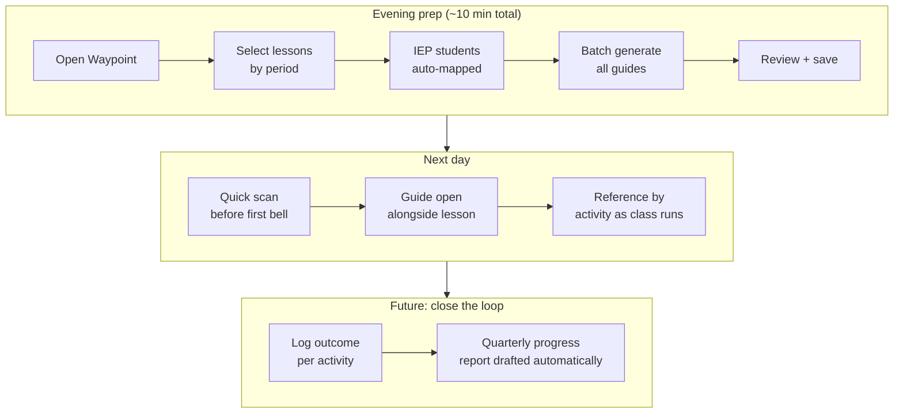
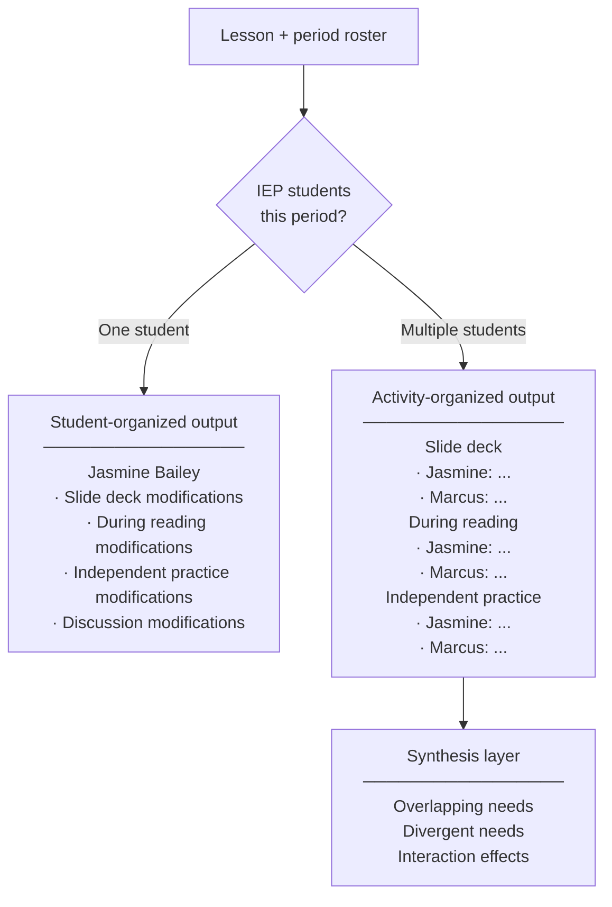
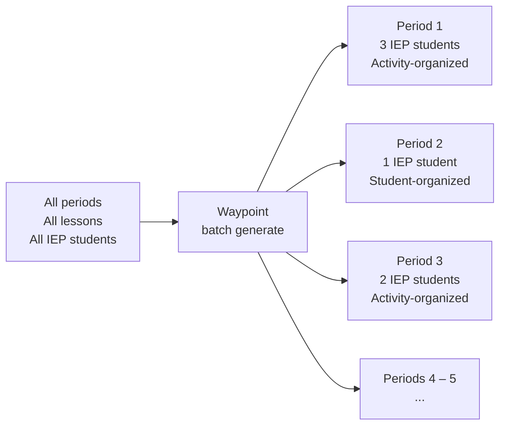

# Waypoint Learning — User Story Map

## Problem Statement

Teachers with IEP students spend hours per week manually translating accommodation documents into lesson-specific modifications — work that is legally required, instructionally critical, and almost never done thoroughly because there is no time. The goal of Waypoint is to reduce that translation work to under ten minutes of active prep per day, producing modification guides specific enough that a teacher can use them without editing.

---

## Teacher Persona

**Maya Torres** | 7th Grade ELA · Riverstone Prep Public Middle School · Worcester, MA

Maya teaches five 45-minute periods per day, roughly 28 students each. Across her day, 15–18 students have active IEPs. She has read every one. She knows Jasmine needs graphic organizers and Marcus needs extended time — that's not the problem. The problem is that translating two dense documents into tomorrow's specific lesson takes an hour she doesn't have. Her prep window is 40 minutes after the last bell.

Maya is not looking for a tool that teaches her about IEPs. She's looking for one that does the intersection work for her and hands her something she can use without editing.

> *"I know what the accommodations are. I don't know what the graphic organizer looks like for this specific short response prompt."*

---

## The Problem

An IEP describes what a student needs in general. A lesson plan describes what the class will do tomorrow. The teacher has to hold both documents simultaneously and produce a third thing — a modification guide — that most teachers never have time to write properly. Waypoint generates that third document automatically, structured around the lesson the teacher is about to teach, not around the IEP sections she already knows.

---

## Teacher Journey

The reporting loop in the final stage is a future capability. Each modification guide already tags recommendations to specific IEP goals, which makes outcome logging and progress reporting tractable once prep is established.

---

## Design Principles

**1. Organize around the lesson, not the IEP.**
Teachers move through a lesson chronologically. The output does too. Modification guides are structured by lesson activity — not by accommodation category, not by student disability.

**2. Ready to use, not ready to interpret.**
Every item in the guide is a specific action, material, or script. A scaffolded version of the actual comprehension question. The exact sentence frame for the short response. The specific behavioral signal to watch for. Nothing the teacher still has to translate.

**3. One operation covers the whole day.**
A teacher with five periods generates five modification guides in a single session. Batch generation — select all periods, all lessons, all students at once — is the default mode, not an advanced feature.

---

## Single vs. Multi-Student Output

The organizational structure of a modification guide depends on how many IEP students share a period.

With multiple students, the output adds a synthesis layer that no single-student guide can produce — noting where needs overlap (one prep task serves both), where they diverge (different scaffolds required at the same activity), and where student interaction creates instructional opportunity.

---

## Batch Prep Flow

Maya teaches five periods. Generating guides one at a time would reduce friction but preserve the session-per-period pattern. Batch generation collapses the entire day into one operation.

The system selects the output format automatically based on IEP student count per period. Teachers can override to student-organized at any time for any period.

---

## What the Teacher Receives

Each modification guide contains, in lesson-activity order:

- **Before class checklist** — materials to print, seating to arrange, partners to pre-assign
- **Per-activity section** — specific modifications, ready-to-use materials (scaffolded questions, sentence frames, warm prompts), and behavioral watch-fors grounded in documented IEP patterns
- **IEP goal tags** — each recommendation is labeled with the goal it serves, enabling future outcome logging without additional teacher effort
